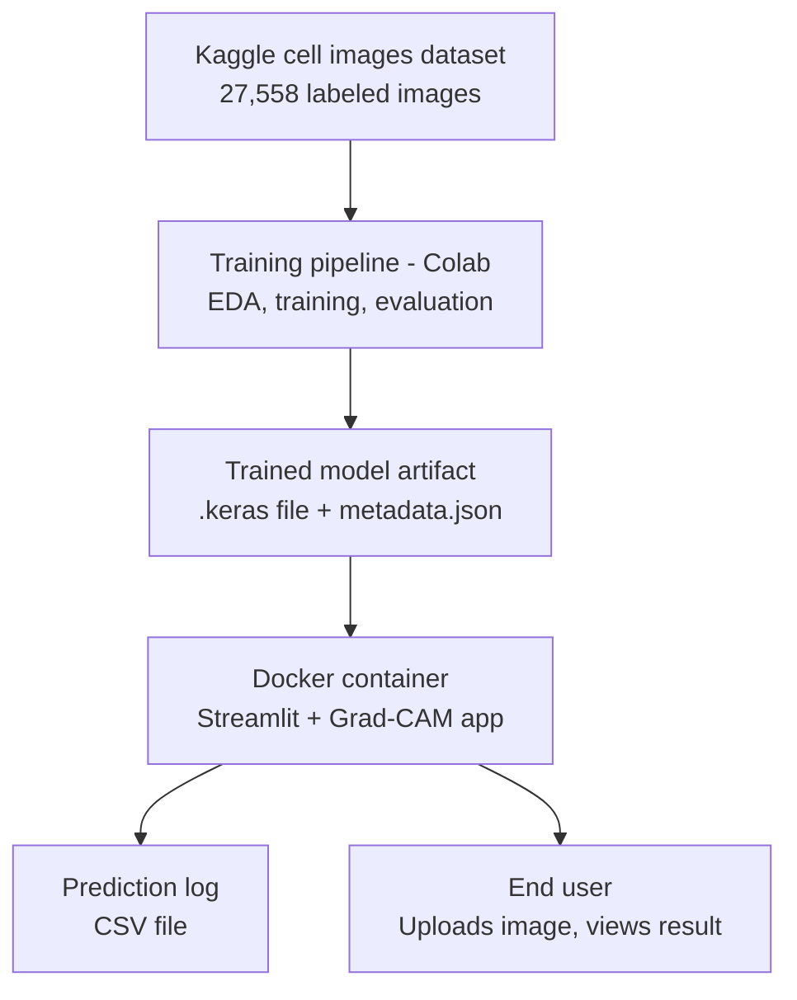

# Malaria Cell Detection — Deployment 

Deployable Streamlit app that loads the trained MobileNetV2 model, classifies
uploaded blood-cell images as **Parasitized** or **Uninfected**, and logs
every prediction.

## Architecture



```
app/
    app.py              # Streamlit inference app
models/
    malaria_mobilenetv2_v1.keras   # <- add this (see models/README.md)
    model_metadata.json
    README.md
tests/
    test_app.py
logs/
    predictions_log.csv            # created automatically at runtime
Dockerfile
requirements.txt
README.md
```

## 1. Add the model file

The notebook currently only checkpoints the Custom CNN. Export the
MobileNetV2 model (the best-performing one) and drop it into `models/`:

```python
model.save("models/malaria_mobilenetv2_v1.keras")
```

See `models/README.md` for the versioning convention.

## 2. Run locally (no Docker)

```bash
python -m venv venv
source venv/bin/activate          # Windows: venv\Scripts\activate
pip install -r requirements.txt
streamlit run app/app.py
```

App opens at `http://localhost:8501`.

## 3. Run the tests

```bash
pip install -r requirements.txt
pytest tests/ -v
```

## 4. Build and run with Docker

```bash
docker build -t malaria-detector .
docker run -p 8501:8501 malaria-detector
```

App available at `http://localhost:8501`.

To deploy a different model version without rebuilding the image:

```bash
docker run -p 8501:8501 -e MODEL_VERSION=v2 -v $(pwd)/models:/app/models malaria-detector
```

## 5. Prediction logging

Every prediction is appended to `logs/predictions_log.csv` with:
`timestamp, filename, prediction, confidence, model_version`.

For a persistent log outside the container, mount a volume:

```bash
docker run -p 8501:8501 -v $(pwd)/logs:/app/logs malaria-detector
```

## 6. Model versioning

- `models/model_metadata.json` describes the currently deployed model
  (architecture, input shape, class order, validation metrics).
- New trained models get a new file (`_v2`, `_v3`, ...); never overwrite an
  existing version.
- Switch versions via the `MODEL_VERSION` environment variable — no code
  change required.
